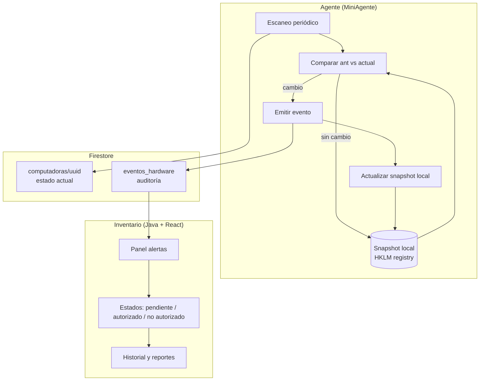

# Plan de desarrollo: Auditoría de cambios de hardware

> **Proyecto:** MiniAgente + MiniAgente-Inventario  
> **Objetivo:** Detectar cambios no autorizados en componentes de PC (monitores, RAM, discos, procesador), reportarlos al inventario y permitir seguimiento IT.  
> **Versión del documento:** 1.4 — Septiembre 2026

---

## 1. Resumen ejecutivo

Se implementará un **sistema de auditoría de hardware** en dos capas:


| Capa                                    | Responsable               | Rol                                               |
| --------------------------------------- | ------------------------- | ------------------------------------------------- |
| **Detección y reporte**                 | Agente (Python / `.exe`)  | Escanear, comparar snapshot local, emitir eventos |
| **Seguimiento, política IT, historial** | Inventario (Java + React) | Alertas, workflow, estados, reportes              |


El agente actúa como **sensor + reporter**. No decide si un cambio está permitido ni gestiona casos IT.

---


## 2. Requerimientos y alcance

Esta sección documenta **qué se pidió**, **qué espera dirección** y **qué queda dentro/fuera del proyecto**, según las conversaciones de diseño previas al plan técnico.

### 2.1 Origen de la necesidad

El agente MiniAgente ya recopila el **estado actual** del hardware de cada PC y lo sincroniza con Firestore (`computadoras/{uuid}`). Eso permite ver qué tiene la máquina **ahora**, pero **no** registra cuándo algo cambió ni permite auditar si el usuario modificó componentes sin pasar por IT.

La necesidad surge de una política operativa: **los usuarios no pueden agregar, quitar o cambiar componentes de hardware sin autorización del área IT**. IT necesita enterarse, llevar registro y dar seguimiento a esos cambios.

### 2.2 Requerimientos planteados por el equipo

Requerimientos funcionales y de diseño definidos durante el análisis:


| #   | Requerimiento                       | Detalle                                                                                                                                                |
| --- | ----------------------------------- | ------------------------------------------------------------------------------------------------------------------------------------------------------ |
| R1  | **Detectar cambios de hardware**    | Comparar el estado anterior de la PC con el actual y detectar diferencias relevantes.                                                                  |
| R2  | **Prioridad inicial: monitores**    | Alertar cuando un monitor se **conecta** o se **desconecta** (caso de uso más visible y frecuente).                                                    |
| R3  | **Reportar cambios a central**      | Cada cambio detectado debe quedar registrado en Firestore para que IT lo vea desde el inventario.                                                      |
| R4  | **Registro de intervenciones**      | Las notificaciones/eventos deben servir como **historial de qué se hizo** en cada equipo (auditoría).                                                  |
| R5  | **Alertar cambios no autorizados**  | Si un usuario modifica hardware sin permiso IT, el sistema debe **generar la alerta**; la evaluación de si estaba autorizado la hace IT después.       |
| R6  | **Comparación local, no en nube**   | El diff se hace entre **snapshot local** (registro Windows) y **escaneo actual** (WMI/PowerShell). Firestore **no** se usa como fuente para comparar.  |
| R7  | **Colección aparte para auditoría** | Los eventos de cambio van a `eventos_hardware`, separados de `computadoras`, que sigue siendo solo la foto actual.                                     |
| R8  | **Separación agente / inventario**  | El **agente** detecta, reporta hechos y setea defaults al crear (`pendiente`). El **inventario** maneja seguimiento, política IT e historial.          |
| R9  | **Bajo impacto en rendimiento**     | La comparación en sí debe ser liviana (listas en memoria); reutilizar escaneos que el agente ya hace (~cada 5 min), sin duplicar WMI innecesariamente. |
| R10 | **Baseline al instalar**            | En el primer arranque sin snapshot previo, guardar estado inicial **sin disparar alertas** (evitar falsos positivos masivos).                          |


### 2.3 Requerimientos solicitados por dirección (jefe)

Ampliación del alcance pedida a nivel gerencial / IT:


| #   | Requerimiento                                | Detalle                                                                                                             |
| --- | -------------------------------------------- | ------------------------------------------------------------------------------------------------------------------- |
| J1  | **Escalar a todos los componentes críticos** | No quedarse solo en monitores: incluir **procesador, RAM, discos y monitores**.                                     |
| J2  | **Funcionalidad estratégica, no parche**     | Tratarlo como **módulo nuevo de auditoría de hardware**, no como un fix puntual de periféricos.                     |
| J3  | **Detección + reporte + seguimiento**        | Flujo completo: detectar → reportar → que IT pueda **dar tratamiento** al caso (¿autorizado?, ¿acción tomada?).     |
| J4  | **Control de compliance IT**                 | Tener visibilidad cuando usuarios **modifican equipos sin autorización**, para accionar según política interna.     |
| J5  | **Registro auditable**                       | Poder consultar **qué cambió, en qué PC y cuándo**, como respaldo ante auditorías o reclamos.                       |
| J6  | **Visibilidad operativa para IT**            | El valor está en que el área IT **vea y gestione** los cambios desde el inventario, no solo logs técnicos en la PC. |


### 2.4 Decisiones de arquitectura acordadas

Traducción de los requerimientos anteriores en decisiones concretas:


| Tema                               | Decisión                                                                 |
| ---------------------------------- | ------------------------------------------------------------------------ |
| **¿Quién detecta?**                | Agente en cada PC.                                                       |
| **¿Dónde se compara?**             | Local (`HKLM\SOFTWARE\AgenteBacar\hardware_snapshot` vs escaneo actual). |
| **¿Dónde se guardan eventos?**     | Firestore, colección raíz `eventos_hardware`.                            |
| **¿Quién hace workflow?**          | Inventario (transiciones y revisión **post-creación**).                  |
| **¿Quién mantiene historial?**     | Inventario (consultas, timeline, reportes).                              |
| **¿El agente aplica política IT?** | **No.** Solo informa que hubo un cambio.                                 |
| **¿Latencia de alertas?**          | ~5 min en v1 (ciclo de escaneo existente); optimizable después.          |
| **¿Atomicidad evento/snapshot?**   | Emitir Firestore primero; snapshot después; dedup en inventario.         |
| **¿TTL eventos?**                  | `expire_at` desde fase 1; limpieza automática fase 6.                    |
| **¿Debounce monitores?**           | No en v1; `evento_relacionado` + debounce en v2.                         |
| **¿Quién setea** `estado_seguimiento`**?** | Agente escribe defaults al **crear** (`pendiente`, `leido: false`); inventario **modifica** después. |


### 2.5 Alcance funcional — versión 1

Consolidación de R1–R10 y J1–J6 en lo que **sí se desarrolla** en esta iniciativa:

#### Agente (MiniAgente)

- Snapshot local persistente de: monitores, RAM, discos, procesador.
- Motor de diff genérico (agregado / removido / modificado).
- Emisión de eventos a `eventos_hardware`.
- Detectores por componente (monitores primero como piloto, luego RAM, discos, CPU).
- Feature flag para activar/desactivar auditoría.
- Tests unitarios y script de prueba local.


#### Inventario (MiniAgente-Inventario)

- Lectura de `eventos_hardware`.
- Panel / badge de alertas (cambios pendientes de revisión).
- Workflow: `pendiente` → `en_revision` → `autorizado` | `no_autorizado` | `falso_positivo`.
- Campos de seguimiento: `revisado_por`, `revisado_en`, `notas_it`, `leido`.
- Historial por PC y listado global filtrable.
- Reportes básicos (cambios no autorizados, por período).


#### Componentes cubiertos en v1


| Componente     | Eventos detectables                                  | Fase prevista   |
| -------------- | ---------------------------------------------------- | --------------- |
| **Monitores**  | Conectado, desconectado                              | Fase 2 (piloto) |
| **RAM**        | Módulo agregado, removido, cambio en ranura          | Fase 4          |
| **Discos**     | Disco agregado, removido, cambio de modelo/capacidad | Fase 4          |
| **Procesador** | Cambio de CPU (post-reinicio / reemplazo)            | Fase 5          |


### 2.6 Fuera de alcance — versión 1

Explícitamente **no** incluido en la primera entrega (evaluable en versiones posteriores):


| Ítem                                                    | Motivo                                                                 |
| ------------------------------------------------------- | ---------------------------------------------------------------------- |
| Periféricos USB genéricos (teclado, mouse, pendrives)   | Mucho ruido operativo; bajo valor para compliance                      |
| Notificaciones email / Slack / Teams                    | Requiere integración aparte; inventario o Cloud Functions en fase 7 → ver **`docs/PLAN_NOTIFICACIONES_HARDWARE_INVENTARIO.md`** |
| Integración con tickets (Jira, etc.)                    | Proceso externo; vincular manualmente vía notas IT en v1               |
| **Bloquear** cambios de hardware en la PC               | Imposible solo con agente; es detección reactiva, no prevención física |
| Hotplug en tiempo real (sub-segundo)                    | Complejidad alta; v1 acepta ~5 min de latencia                         |
| Política IT automatizada (“si cambio X → bloquear red”) | Decisión humana en inventario en v1                                    |
| Comparar contra Firestore para detectar cambios         | Descartado: lento, costoso, impreciso                                  |


### 2.7 Matriz requerimiento → responsable


| Requerimiento                       | Agente    | Inventario      | Firestore                   |
| ----------------------------------- | --------- | --------------- | --------------------------- |
| Detectar cambio                     | ✓         |                 |                             |
| Snapshot local                      | ✓         |                 |                             |
| Emitir evento                       | ✓         |                 | `eventos_hardware` (create) |
| Defaults workflow al crear          | ✓         |                 | `pendiente`, `leido`        |
| Estado actual PC                    | ✓         |                 | `computadoras` (sync)       |
| Alertas en UI                       |           | ✓               |                             |
| Workflow / seguimiento              |           | ✓               | update post-creación        |
| Historial consultable               |           | ✓               | read `eventos_hardware`     |
| Política autorizado / no autorizado |           | ✓               |                             |
| Registro auditable                  | ✓ (hecho) | ✓ (contexto IT) | persistencia                |


---


## 3. Problema técnico actual

- Los usuarios no deberían modificar hardware sin autorización IT, pero **no hay mecanismo** que lo registre.
- Hoy el agente **sobrescribe** el estado en `computadoras/{uuid}` en cada sync → **no hay timeline** de cambios.
- Existe infraestructura de hash MD5 en `firebase_client.py` pero **no se usa** para periféricos en sync incremental.
- IT necesita: **qué cambió**, **cuándo**, **en qué PC**, y poder **marcar** el seguimiento.

---


## 4. Alcance técnico resumido

> Referencia rápida; el detalle contractual está en §2.5 y §2.6.


### Incluido (v1)


| Componente     | Eventos detectables                                                         |
| -------------- | --------------------------------------------------------------------------- |
| **Monitores**  | Conectado, desconectado                                                     |
| **RAM**        | Módulo agregado, removido, cambio de capacidad/modelo en ranura             |
| **Discos**     | Disco agregado, removido, cambio de modelo/capacidad                        |
| **Procesador** | Cambio de CPU (típico tras reemplazo de placa o reinicio post-intervención) |


### Fuera de alcance (v1)

- Periféricos USB genéricos (teclado/mouse) — alto ruido, evaluar en v2
- Notificaciones email/Slack — inventario o Cloud Functions (fase posterior)
- Integración con sistema de tickets (Jira, etc.) — fase posterior
- Bloqueo físico de cambios en la PC — imposible solo con software agente

---


## 5. Arquitectura


### 5.1 Diagrama de flujo




### 5.2 División de responsabilidades


#### Agente — SÍ

- Escanear hardware actual (reutilizar `scanner.py`, `perifericos.py`).
- Persistir **snapshot local** en registro Windows.
- Comparar snapshot anterior vs escaneo actual (**solo local**, nunca contra Firestore).
- Escribir documentos nuevos en `eventos_hardware` cuando hay diff (incl. defaults: `estado_seguimiento: "pendiente"`, `leido: false`).
- Actualizar snapshot local tras cada comparación exitosa.
- Regla de **baseline**: primer arranque sin snapshot → guardar sin alertar.


#### Agente — NO

- **Modificar** estados de seguimiento post-creación (`en_revision`, `autorizado`, `no_autorizado`, `falso_positivo`) ni campos de revisión.
- Política IT, notas (`notas_it`), revisión por usuario (`revisado_por`, `revisado_en`).
- UI, badges, reportes.
- Leer `eventos_hardware` para comparar.
- Re-escribir o actualizar documentos de eventos ya creados (solo **create**, nunca update).


#### Inventario — SÍ

- Leer `eventos_hardware` (listener o polling).
- Panel de cambios pendientes / alertas.
- Workflow: `pendiente` → `en_revision` → `autorizado` | `no_autorizado` | `falso_positivo` (transiciones post-creación).
- Campos de revisión: `revisado_por`, `revisado_en`, `notas_it`, `leido` (actualizar `leido` al marcar alerta vista).
- Historial por PC y reportes globales.
- (Opcional, Fase 7) Notificaciones email/Slack — ver `docs/PLAN_NOTIFICACIONES_HARDWARE_INVENTARIO.md`

---


## 6. Modelo de datos


### 6.1 Snapshot local (agente)

**Ubicación primaria:** `HKLM\SOFTWARE\AgenteBacar\hardware_snapshot`  
**Formato:** JSON en `REG_SZ`  
**Caché en memoria:** variable global; se lee del registro solo al arranque del servicio.

**Límite de tamaño (REG_SZ):**

- En la práctica, `REG_SZ` admite del orden de **~16 KB** por valor (límite efectivo de Windows para strings de registro).
- Un JSON con 4 tipos de componentes suele ser pequeño (1–4 monitores, 2–4 módulos RAM, pocos discos), pero **PCs con muchos discos/RAM/monitores** pueden acercarse al límite.
- **Mitigación en implementación:**
  1. Al guardar, medir tamaño UTF-8 del JSON; log de advertencia si supera **12 KB** (umbral conservador).
  2. Snapshot **minimalista**: solo `fingerprint` + campos mínimos para UI del evento, no el payload completo de `obtener_datos_pc()`.
  3. **Fallback** si supera umbral o falla escritura en registro:
    - **Opción A (preferida):** archivo local `C:\ProgramData\AgenteBacar\hardware_snapshot.json` (mismo contenido; registro guarda puntero `storage= file` opcional).
    - **Opción B:** `REG_MULTI_SZ` partido en chunks (más complejo; solo si A no es viable).
- Tests: fixture con PC “extrema” (8 discos, 4 RAM, 4 monitores) y assert tamaño < 12 KB o activación de fallback.

```json
{
  "version": 1,
  "actualizado_en": "2026-09-03T14:30:00Z",
  "monitores": [
    {
      "fingerprint": "SN:ABC123",
      "nombre": "LG 24\"",
      "numero_serie": "ABC123",
      "instance_name": "DISPLAY\\...",
      "pulgadas": 24,
      "fabricante": "LG"
    }
  ],
  "ram": [
    {
      "fingerprint": "DIMM_A1|SN:XYZ|16",
      "slot": "DIMM_A1",
      "locator": "ChannelA-DIMM0",
      "capacidad_gb": 16,
      "numero_serie": "XYZ",
      "modelo": "KVR..."
    }
  ],
  "discos": [
    {
      "fingerprint": "SN:DISK001|512",
      "modelo": "Samsung SSD 870",
      "numero_serie": "DISK001",
      "capacidad_gb": 512,
      "tipo": "SSD"
    }
  ],
  "procesador": {
    "fingerprint": "Intel i5-10400|6",
    "nombre_completo": "Intel(R) Core(TM) i5-10400 CPU @ 2.90GHz",
    "nucleos_fisicos": 6,
    "gama": "i5",
    "modelo": "10400"
  }
}
```

**Reglas de fingerprint** (estables, excluir campos volátiles):


| Componente | Prioridad de ID                                                   | Excluir del diff    |
| ---------- | ----------------------------------------------------------------- | ------------------- |
| Monitor    | `numero_serie` → `instance_name` → `{fabricante,pulgadas,nombre}` | `resolucion`        |
| RAM        | `{slot,locator}` + `numero_serie` → `{slot,capacidad_gb,modelo}`  | —                   |
| Disco      | `numero_serie` → `{modelo,capacidad_gb}`                          | espacio libre/usado |
| Procesador | `{nombre_completo,nucleos_fisicos}`                               | uso CPU %           |


**Limitación conocida — monitores idénticos sin serial:**

- Si dos monitores comparten el mismo `{fabricante, pulgadas, nombre}` y **no** exponen `numero_serie`, el fallback de fingerprint **no distingue cuál es cuál** (ej. 2× Dell P2422H).
- Al desconectar uno, el diff puede reportar `removido` sin identificar la unidad exacta, o alternar fingerprints si cambia el orden WMI.
- `instance_name` de WMI ayuda, pero **puede cambiar** si el monitor se mueve de puerto (HDMI1 ↔ HDMI2).
- **Documentar para IT:** en equipos con monitores gemelos sin serial, los eventos pueden ser ambiguos; usar `falso_positivo` o verificación manual.
- **v2 (opcional):** fingerprint enriquecido con orden de puerto / EDID parcial si está disponible.


### 6.2 Colección Firestore: `eventos_hardware`

**Tipo:** colección raíz (facilita panel global “todos los pendientes”).

**Índices sugeridos:**

- `(estado_seguimiento ASC, timestamp DESC)`
- `(uuid ASC, timestamp DESC)`
- `(tipo_componente ASC, timestamp DESC)`

**Documento — campos escritos por el agente:**

```json
{
  "uuid": "abc-123",
  "hostname": "OFICINA01",
  "tipo_componente": "monitor",
  "tipo_evento": "agregado",
  "timestamp": "<SERVER_TIMESTAMP>",
  "antes": null,
  "despues": {
    "nombre": "LG 24\"",
    "numero_serie": "ABC123",
    "pulgadas": 24
  },
  "fingerprint": "SN:ABC123",
  "origen": "agente",
  "version_agente": "5.5.0",
  "expire_at": "<Timestamp + 90 días>"
}
```

**TTL desde fase 1:** incluir `expire_at` en **cada documento** al crearlo (p. ej. now + 90 días), aunque el job de limpieza automática se implemente en fase 6. Así no hay que migrar docs viejos cuando se active la purga. Con **200+ PCs** y eventos cada pocos días, la colección crece rápido sin TTL.

**Idempotencia / duplicados (inventario):** el agente puede reemitir el mismo evento si crashea entre Firestore y snapshot (ver §6.4). El inventario debe **tolerar duplicados** consultando si ya existe un doc reciente con mismo `uuid` + `fingerprint` + `tipo_evento` + `tipo_componente` en ventana de **~10 minutos** (lógica en backend o al mostrar lista).

**v2 — campo opcional:** `evento_relacionado` (ID de otro doc) para vincular pares agregado/removido cuando se implemente debounce.

**Valores de** `tipo_componente`**:** `monitor` | `ram` | `disco` | `procesador`

**Valores de** `tipo_evento`**:** `agregado` | `removido` | `modificado`

**Campos al crear el documento:**

| Campo | Quién escribe | Cuándo |
|-------|---------------|--------|
| `uuid`, `hostname`, `tipo_*`, `antes`, `despues`, `fingerprint`, `origen`, `version_agente`, `timestamp`, `expire_at` | **Agente** | create |
| `estado_seguimiento: "pendiente"`, `leido: false` | **Agente** | create (defaults) |
| `revisado_por`, `revisado_en`, `notas_it` | **Inventario** | update |
| Transiciones de `estado_seguimiento` | **Inventario** | update |

**Defaults que escribe el agente al crear** (evita docs huérfanos sin estado):

```json
{
  "estado_seguimiento": "pendiente",
  "leido": false
}
```

**Campos que solo actualiza inventario** (agente no los toca post-creación):

```json
{
  "estado_seguimiento": "en_revision | autorizado | no_autorizado | falso_positivo",
  "revisado_por": "...",
  "revisado_en": "...",
  "notas_it": "...",
  "leido": true
}
```

**Valores de** `estado_seguimiento`**:** `pendiente` | `en_revision` | `autorizado` | `no_autorizado` | `falso_positivo`

### 6.3 Relación con `computadoras`

- `computadoras/{uuid}` sigue siendo la **foto actual** (sync existente).
- `eventos_hardware` es la **línea de tiempo de cambios**.
- No duplicar historial dentro del doc de computadora.


### 6.4 Consideraciones de diseño (decisiones explícitas)


#### Atomicidad: eventos vs snapshot

Escenario de fallo: el agente emite eventos a Firestore pero **crashea antes** de persistir el snapshot local → en el próximo ciclo reemitiría los mismos eventos.


| Estrategia                             | Pros                                  | Contras                                                          |
| -------------------------------------- | ------------------------------------- | ---------------------------------------------------------------- |
| Guardar snapshot **antes** de emitir   | No duplica eventos                    | Si Firestore falla, **se pierde** el evento (snapshot ya avanzó) |
| Guardar snapshot **después** de emitir | No se pierden eventos si Firestore OK | Riesgo de **duplicados** si crash post-emit                      |
| Transacción real local+remota          | Ideal                                 | No existe entre registro Windows y Firestore                     |


**Decisión v1:** **emitir eventos primero → confirmar escritura Firestore → guardar snapshot después.**

- Si Firestore falla: **no** actualizar snapshot; reintentar en el próximo ciclo (mismo diff).
- Si Firestore OK pero crash antes del snapshot: duplicados posibles → **inventario deduplica** (§6.2).
- Log en `agente_debug.txt`: `AUDIT_EMIT_OK`, `AUDIT_SNAPSHOT_SAVED`, `AUDIT_EMIT_FAIL`.


#### Sin debounce en v1

Desconectar un monitor ~30 s y reconectarlo genera **2 eventos** (`removido` + `agregado`). Aceptado en v1:

- IT marca `falso_positivo` o cierra ambos como intervención menor.
- **v2:** debounce (ignorar removido si reaparece en N minutos) y/o campo `evento_relacionado` entre el par.


#### Volumen de `eventos_hardware`

- Estimar: 200 PCs × ~2 eventos/mes ≈ 400 docs/mes sin contar ruido de monitores.
- `expire_at` desde **fase 1**; limpieza batch en **fase 6** (mismo patrón que `logs_debug`).
- Índice por `expire_at` para el job de purga.

---


## 7. Cuándo escanear y comparar


| Componente | Momento de escaneo                                                                        | Momento de diff                                              | Latencia alerta                                                       |
| ---------- | ----------------------------------------------------------------------------------------- | ------------------------------------------------------------ | --------------------------------------------------------------------- |
| Monitores  | Cada ciclo pesado (~5 min, `incluir_pesados=True`)                                        | Tras obtener monitores                                       | ~5 min                                                                |
| RAM        | Sync pesada / datos estáticos en cache                                                    | Tras `_obtener_ram_completa` o al detectar cambio en módulos | ~5–30 min                                                             |
| Discos     | Sync pesada                                                                               | Tras `obtener_info_discos_fisicos` + salud                   | ~5–30 min                                                             |
| Procesador | Lectura en cache estático (`inicializar_cache()`); **diff solo al arranque del servicio** | Una vez en `SvcDoRun`, antes del loop de 5 min               | Tras reinicio del servicio (o primera instalación post-cambio físico) |


**Procesador — aclaración:** el diff de CPU **no** corre en el ciclo cada 5 min. `_CACHE_ESTATICO` en `scanner.py` se llena una vez por proceso; un cambio de CPU solo se detecta cuando el **servicio se reinicia** (típico tras apagar la PC para cambiar hardware). No confundir con “cambio de cache” en sync incremental.

**Nota:** No agregar escaneos WMI extra en v1. Reutilizar datos ya obtenidos en `obtener_datos_pc()`.

---


## 8. Implementación — Agente (MiniAgente)


### 8.1 Estructura de archivos nuevos

```
src/core/
├── hardware_snapshot.py      # Leer/escribir snapshot en registro + caché memoria
├── hardware_fingerprint.py   # Fingerprints por componente
├── hardware_diff.py          # Diff genérico: agregado / removido / modificado
├── hardware_audit.py         # Orquestador: armar snapshot actual, comparar, devolver eventos
└── detectores/
    ├── monitor_detector.py
    ├── ram_detector.py
    ├── disco_detector.py
    └── procesador_detector.py

tests/
├── test_hardware_fingerprint.py
├── test_hardware_diff.py
└── test_hardware_audit.py

scripts/
└── test_hardware_audit_local.py   # Prueba diff sin Firebase
```


### 8.2 Cambios en archivos existentes


| Archivo                           | Cambio                                                                          |
| --------------------------------- | ------------------------------------------------------------------------------- |
| `src/core/perifericos.py`         | Exportar `instance_name` WMI en monitores                                       |
| `src/core/scanner.py`             | Exponer helpers para armar secciones del snapshot                               |
| `src/database/firebase_client.py` | `emitir_eventos_hardware(eventos)`, helpers registro snapshot                   |
| `main.py`                         | Tras sync inicial: baseline snapshot; en cada ciclo: audit si hay datos pesados |
| `config/config.py`                | `HARDWARE_AUDIT_ENABLED = True`, versión bump                                   |
| `README.md`                       | Sección auditoría de hardware                                                   |


### 8.3 API interna propuesta

```python
# hardware_audit.py

def construir_snapshot_actual(datos_pc: dict) -> dict:
    """Arma el snapshot normalizado desde obtener_datos_pc()."""

def detectar_cambios(snapshot_anterior: dict | None, snapshot_actual: dict) -> list[dict]:
    """
    Returns lista de eventos listos para Firestore.
    Si snapshot_anterior is None → baseline, retorna [].
    """

def procesar_auditoria_hardware(datos_pc: dict, uuid: str, hostname: str) -> list[dict]:
    """
    1. Cargar snapshot anterior (memoria/registro)
    2. Construir snapshot actual
    3. detectar_cambios
    4. Si hay eventos → emitir a Firestore
    5. Guardar snapshot actual en registro + memoria
    """
```

```python
# firebase_client.py

def emitir_eventos_hardware(eventos: list[dict]) -> None:
    """Batch write a colección eventos_hardware. Solo campos del agente."""

def leer_hardware_snapshot_registro() -> dict | None: ...
def guardar_hardware_snapshot_registro(snapshot: dict) -> None: ...
```


### 8.4 Integración en el bucle del servicio

```
SvcDoRun:
  1. Sync inicial completa
  2. procesar_auditoria_hardware() → baseline (sin eventos)
  3. procesar_auditoria_procesador() → diff CPU solo aquí (arranque)
  4. Loop cada 5 min:
       datos = obtener_datos_pc()
       enviar_datos_pc(datos)
       if incluir_pesados:
           procesar_auditoria_hardware(datos, uuid, hostname)  # monitores, RAM, discos
```


### 8.5 Reglas de negocio (agente)

1. **Primer arranque** (sin snapshot en registro): guardar snapshot, **cero eventos**.
2. **Reinicio del servicio** con snapshot existente: comparar normalmente.
3. **Múltiples cambios en un ciclo**: un evento por componente afectado (o batch de eventos).
4. **Campos volátiles** no disparan eventos (resolución de monitor, % disco libre).
5. **Atomicidad eventos / snapshot** (§6.4): emitir a Firestore → si OK, guardar snapshot local; si Firestore falla, no actualizar snapshot.
6. **Feature flag** `HARDWARE_AUDIT_ENABLED` para desactivar sin redeploy completo.
7. **Tamaño snapshot:** validar JSON < 12 KB; fallback a archivo en `ProgramData` si excede o falla registro.

### 8.6 Desarrollo detallado del agente

Spec técnica para implementación. Referencia codebase actual en `C:\Users\Usr\Documents\Desarrollo\MiniAgente`.

#### 8.6.1 Flujo completo (una función orquestadora)

```
procesar_auditoria_hardware(datos_pc, uuid, hostname, secciones=('monitores','ram','discos'))
  │
  ├─ if not HARDWARE_AUDIT_ENABLED: return []
  ├─ snapshot_actual = construir_snapshot_actual(datos_pc, secciones)
  ├─ snapshot_anterior = hardware_snapshot.cargar()   # memoria → registro → archivo
  │
  ├─ if snapshot_anterior is None:
  │     hardware_snapshot.guardar(snapshot_actual)    # baseline, sin eventos
  │     return []
  │
  ├─ eventos = detectar_cambios(snapshot_anterior, snapshot_actual, secciones)
  │
  ├─ if eventos:
  │     emitir_eventos_hardware(eventos, uuid, hostname)  # Firestore primero
  │
  └─ hardware_snapshot.guardar(snapshot_actual)       # solo si emit OK o eventos vacíos
```

Función aparte en arranque:

```
procesar_auditoria_procesador(datos_pc, uuid, hostname)
  └─ mismo flujo pero secciones=('procesador',) — llamar una vez en SvcDoRun antes del loop
```

#### 8.6.2 Mapeo `datos_pc` → snapshot

Fuente: `obtener_datos_pc()` en `scanner.py`. Solo campos necesarios para fingerprint (snapshot minimalista).

| Sección snapshot | Origen en `datos_pc` | Campos usados | Notas |
|------------------|----------------------|---------------|-------|
| `monitores[]` | `datos['perifericos']['monitores']` | `nombre`, `numero_serie`, `fabricante`, `pulgadas`, `instance_name` | **Nuevo:** exportar `instance_name` en `perifericos.py`. **No** incluir `resolucion`. |
| `ram[]` | `datos['modulos_ram']` | Solo entradas con `ocupado: true`: `slot`, `locator`, `numero_serie`, `capacidad_gb`, `modelo` | Ranuras vacías no van al snapshot (solo módulos presentes). |
| `discos[]` | `datos['info_discos']` (cache) + enriquecimiento | `device_id`, `modelo`, `tipo`, `numero_serie` (fase 4) | Hoy `info_discos` no trae serial → ampliar `obtener_info_discos_fisicos()` con `SerialNumber` de `Get-PhysicalDisk`. |
| `procesador` | `datos['procesador_detallado']` o cache | `nombre_completo`, `nucleos_fisicos`, `gama`, `modelo` | Objeto único, no lista. |

**Helper en `scanner.py` (nuevo):**

```python
def obtener_secciones_auditoria(datos_pc: dict) -> dict:
    """Extrae y normaliza monitores, ram, discos, procesador para hardware_audit."""
```

Implementación sugerida: leer de `datos_pc` si está; para discos/RAM estáticos, usar `inicializar_cache()` si falta en `datos_pc` (sync ligera).

#### 8.6.3 `hardware_snapshot.py`

Persistencia local. Reutilizar patrón de `machine_id` en `firebase_client.py` (`HKLM\SOFTWARE\AgenteBacar`).

```python
_REGISTRY_KEY = r"SOFTWARE\AgenteBacar"
_REGISTRY_VALUE = "hardware_snapshot"
_REGISTRY_STORAGE = "hardware_snapshot_storage"  # "registry" | "file"
_FILE_PATH = r"C:\ProgramData\AgenteBacar\hardware_snapshot.json"
_SIZE_WARN_BYTES = 12 * 1024
_SCHEMA_VERSION = 1

_cache_memoria: dict | None = None

def cargar() -> dict | None:
    """Memoria → registro → archivo. None si no existe (baseline)."""

def guardar(snapshot: dict) -> bool:
    """Serializa JSON compacto, valida tamaño, escribe registro o fallback file."""

def invalidar_cache() -> None:
    """Solo tests / RESETEAR_ID remoto."""

def _normalizar_snapshot(raw: dict) -> dict:
    """Asegura version, actualizado_en ISO8601 UTC, listas ordenadas por fingerprint."""

def _escribir_registro(json_str: str) -> bool: ...

def _escribir_archivo(json_str: str) -> bool: ...

def _leer_registro() -> str | None: ...

def _leer_archivo() -> str | None: ...
```

**Reglas:**

- Ordenar listas por `fingerprint` antes de guardar (diff determinista).
- Si JSON UTF-8 > `_SIZE_WARN_BYTES`: log warning + intentar `_FILE_PATH`; setear `hardware_snapshot_storage=file` en registro.
- Crear `C:\ProgramData\AgenteBacar\` si no existe (servicio SYSTEM tiene permisos).

#### 8.6.4 `hardware_fingerprint.py`

```python
def fingerprint_monitor(m: dict) -> str: ...
def fingerprint_ram(m: dict) -> str: ...
def fingerprint_disco(d: dict) -> str: ...
def fingerprint_procesador(p: dict) -> str: ...

def enriquecer_con_fingerprint(seccion: str, item: dict) -> dict:
    """Añade campo fingerprint al dict del snapshot."""
```

**Lógica por componente:**

| Función | Algoritmo |
|---------|-----------|
| `fingerprint_monitor` | Si `numero_serie` válido (no vacío, no solo ceros) → `SN:{serial}`. Si no, si `instance_name` → `INST:{instance_name}`. Si no → `FALLBACK:{fabricante}|{pulgadas}|{nombre_normalizado}`. |
| `fingerprint_ram` | Si `numero_serie` != `N/A` → `RAM:{locator}|SN:{serial}`. Si no → `RAM:{locator}|{capacidad_gb}|{modelo}`. |
| `fingerprint_disco` | Si `numero_serie` → `DISK:SN:{serial}`. Si no → `DISK:{device_id}|{modelo}|{tipo}`. |
| `fingerprint_procesador` | `CPU:{nombre_completo}|{nucleos_fisicos}` |

Tests obligatorios: serial vacío, dos monitores fallback iguales, RAM sin serial, disco solo por device_id.

#### 8.6.5 `hardware_diff.py`

Diff genérico por conjunto de fingerprints.

```python
@dataclass
class CambioHardware:
    tipo_componente: str      # monitor | ram | disco | procesador
    tipo_evento: str          # agregado | removido | modificado
    fingerprint: str
    antes: dict | None
    despues: dict | None

def diff_listas(
    tipo_componente: str,
    anteriores: list[dict],
    actuales: list[dict],
) -> list[CambioHardware]:
    """
    Indexa por fingerprint.
    Solo en actuales → agregado.
    Solo en anteriores → removido.
    Mismo fingerprint pero dict distinto (campos no volátiles) → modificado.
    """

def diff_procesador(anterior: dict | None, actual: dict | None) -> list[CambioHardware]:
    """Un solo objeto; modificado si fingerprint distinto; agregado/removido si uno es None."""

def cambios_a_eventos_firestore(
    cambios: list[CambioHardware],
    uuid: str,
    hostname: str,
    version_agente: str,
) -> list[dict]:
    """Arma payloads listos para emitir_eventos_hardware."""
```

**Campos que ignorar en comparación `modificado`:**

- Monitor: `resolucion`
- Disco: `total_gb`, `usado_gb`, `libre_gb`, `porcentaje_usado`
- RAM: `velocidad_mhz` (opcional, puede variar levemente — excluir en v1)

#### 8.6.6 Detectores (`src/core/detectores/`)

Cada detector es un wrapper fino; la lógica pesada está en fingerprint + diff.

| Módulo | Entrada | Salida | Fase |
|--------|---------|--------|------|
| `monitor_detector.py` | `list[dict]` monitores | `list[CambioHardware]` | 2 |
| `ram_detector.py` | `list[dict]` módulos ocupados | `list[CambioHardware]` | 4 |
| `disco_detector.py` | `list[dict]` discos físicos | `list[CambioHardware]` | 4 |
| `procesador_detector.py` | `dict` procesador | `list[CambioHardware]` | 5 |

```python
# monitor_detector.py
def detectar_cambios_monitores(anteriores: list, actuales: list) -> list[CambioHardware]:
    return diff_listas('monitor', anteriores, actuales)
```

`hardware_audit.py` invoca detectores según `secciones` solicitadas.

#### 8.6.7 `hardware_audit.py` — orquestador

```python
from config.config import HARDWARE_AUDIT_ENABLED

SECCIONES_CICLO = ('monitores', 'ram', 'discos')
SECCIONES_ARRANQUE = ('procesador',)

def construir_snapshot_actual(datos_pc: dict, secciones: tuple) -> dict:
    """Retorna dict con version, actualizado_en, y solo las secciones pedidas."""

def detectar_cambios(
    snapshot_anterior: dict,
    snapshot_actual: dict,
    secciones: tuple,
) -> list[dict]:
    """Combina detectores; retorna eventos Firestore (sin escribir)."""

def procesar_auditoria_hardware(
    datos_pc: dict,
    uuid: str,
    hostname: str,
    secciones: tuple = SECCIONES_CICLO,
) -> list[dict]:
    """Flujo completo §8.6.1."""

def procesar_auditoria_procesador(datos_pc: dict, uuid: str, hostname: str) -> list[dict]:
    return procesar_auditoria_hardware(datos_pc, uuid, hostname, secciones=SECCIONES_ARRANQUE)
```

#### 8.6.8 `firebase_client.py` — emisión de eventos

```python
_EVENTOS_COLLECTION = "eventos_hardware"
_EVENTOS_TTL_DIAS = 90

def emitir_eventos_hardware(eventos: list[dict], uuid: str, hostname: str) -> bool:
    """
    - Enriquece cada evento: uuid, hostname, origen='agente', version_agente, timestamp.
    - estado_seguimiento='pendiente', leido=False  ← agente SÍ setea defaults de workflow
      (inventario solo actualiza después; evita docs sin estado).
    - expire_at = now + 90 días.
    - Batch commit (máx 400 ops por batch, patrón sincronizar_programas_instalados).
    - Retorna True si todos OK; False → NO actualizar snapshot.
    - Log: AUDIT_EMIT_OK / AUDIT_EMIT_FAIL.
    """
```

**Nota:** el agente escribe `estado_seguimiento: "pendiente"` al **crear** el doc. No vuelve a escribir el doc después; el inventario hace update de workflow.

#### 8.6.9 Cambios en archivos existentes (detalle)

##### `src/core/perifericos.py`

En el script PowerShell de `obtener_monitores()`, agregar al `[PSCustomObject]`:

```powershell
InstanceName = $id
```

En el loop Python:

```python
entry['instance_name'] = (monitor.get('InstanceName') or '').strip()
```

##### `src/core/scanner.py`

```python
def obtener_discos_fisicos_auditoria() -> list[dict]:
    """
    Combina info_discos (cache) en lista [{device_id, modelo, tipo, numero_serie?}].
    Fase 4: ampliar obtener_info_discos_fisicos() para incluir SerialNumber.
    """

def obtener_secciones_auditoria(datos_pc: dict) -> dict:
    """Usado por hardware_audit.construir_snapshot_actual."""
```

##### `main.py` — `SvcDoRun`

Después de `enviar_datos_pc(datos)` inicial:

```python
from src.core.hardware_audit import (
    procesar_auditoria_hardware,
    procesar_auditoria_procesador,
)

# Baseline + CPU (arranque)
procesar_auditoria_hardware(datos, uuid_final, datos.get('hostname', ''))
procesar_auditoria_procesador(datos, uuid_final, datos.get('hostname', ''))

# Loop 5 min — tras enviar_datos_pc(datos_ciclo):
procesar_auditoria_hardware(datos_ciclo, uuid_final, datos_ciclo.get('hostname', ''))
```

##### `config/config.py`

```python
HARDWARE_AUDIT_ENABLED = True
HARDWARE_AUDIT_TTL_DIAS = 90
```

##### Comando remoto `RESETEAR_ID`

Opcional v1: al resetear machine_id, llamar `hardware_snapshot.invalidar_cache()` y borrar registro snapshot para forzar nuevo baseline en esa PC.

#### 8.6.10 Checklist por archivo (tickets)

| # | Archivo | Tareas | Fase |
|---|---------|--------|------|
| T1 | `hardware_fingerprint.py` | 4 funciones fingerprint + tests | 1 |
| T2 | `hardware_diff.py` | diff_listas, diff_procesador, cambios_a_eventos | 1 |
| T3 | `hardware_snapshot.py` | cargar/guardar registro+file+caché | 1 |
| T4 | `firebase_client.py` | emitir_eventos_hardware + TTL | 1 |
| T5 | `hardware_audit.py` | orquestador completo | 1 |
| T6 | `perifericos.py` | instance_name en monitores | 2 |
| T7 | `monitor_detector.py` + integración main | MVP monitores | 2 |
| T8 | `scanner.py` | discos con serial + obtener_secciones_auditoria | 4 |
| T9 | `ram_detector.py` + `disco_detector.py` | | 4 |
| T10 | `procesador_detector.py` + hook arranque | | 5 |
| T11 | `tests/*` + `scripts/test_hardware_audit_local.py` | | 1–5 |
| T12 | `README.md` + bump VERSION | | 2 |

#### 8.6.11 Payload de evento (contrato final agente → Firestore)

```json
{
  "uuid": "abc-123",
  "hostname": "OFICINA01",
  "tipo_componente": "monitor",
  "tipo_evento": "agregado",
  "fingerprint": "SN:ABC123",
  "antes": null,
  "despues": {
    "nombre": "LG 24\"",
    "numero_serie": "ABC123",
    "pulgadas": 24,
    "fabricante": "LG",
    "instance_name": "DISPLAY\\..."
  },
  "origen": "agente",
  "version_agente": "5.6.0",
  "timestamp": "<SERVER_TIMESTAMP>",
  "expire_at": "<Timestamp + 90d>",
  "estado_seguimiento": "pendiente",
  "leido": false
}
```

#### 8.6.12 Rollout en PCs ya desplegadas

1. Publicar `.exe` con `HARDWARE_AUDIT_ENABLED = True`.
2. **Primer ciclo por PC:** sin snapshot → baseline silencioso (0 eventos).
3. **Segundo ciclo en adelante:** diff activo.
4. Deploy gradual: piloto 5–10 PCs → área → parque completo.
5. Comunicar a IT: primera semana puede haber ruido en monitores sin serial; usar `falso_positivo`.

Comando `RESETEAR_ID` o reinstalar agente → nuevo baseline (útil tras intervención IT documentada).

#### 8.6.13 Tests mínimos

| Test | Archivo |
|------|---------|
| Fingerprint monitor con/sin serial | `test_hardware_fingerprint.py` |
| Diff agregado + removido mismo ciclo | `test_hardware_diff.py` |
| Baseline no emite eventos | `test_hardware_audit.py` |
| Snapshot roundtrip registro (mock winreg) | `test_hardware_snapshot.py` |
| Resolución cambia, fingerprint igual → 0 eventos | `test_hardware_diff.py` |
| emitir_eventos incluye expire_at | mock firebase_client |

Script manual:

```powershell
python scripts/test_hardware_audit_local.py
python scripts/test_hardware_audit_local.py --simular-monitor-agregado
python scripts/test_hardware_audit_local.py --baseline
```

---

## 9. Implementación — Inventario (MiniAgente-Inventario)

> Referencia para el equipo de inventario. No forma parte del `.exe`.


### 9.1 Backend Java


| Tarea                   | Detalle                                                                                                        |
| ----------------------- | -------------------------------------------------------------------------------------------------------------- |
| Modelo `EventoHardware` | Mapeo Firestore snake_case                                                                                     |
| Repository / Service    | CRUD lectura + update estados                                                                                  |
| API REST                | `GET /eventos-hardware?estado=pendiente`, `PATCH /eventos-hardware/{id}`                                       |
| Índices Firestore       | Crear en consola o `firestore.indexes.json`                                                                    |
| **Deduplicación**       | Al listar o ingestar: ignorar/agrupar docs con mismo `uuid` + `fingerprint` + `tipo_evento` en ventana ~10 min |


### 9.2 Frontend React


| Pantalla            | Funcionalidad                                                       |
| ------------------- | ------------------------------------------------------------------- |
| **Alertas / badge** | Contador eventos `pendiente` + `leido=false`                        |
| **Lista global**    | Filtros: PC, componente, estado, fecha                              |
| **Detalle evento**  | Antes/después, botones autorizar / rechazar / falso positivo, notas |
| **Timeline por PC** | Tab en ficha de computadora                                         |
| **Reportes**        | Cambios no autorizados por mes, por área                            |


### 9.3 Workflow IT (inventario)

```
Evento creado (agente) → estado_seguimiento: "pendiente"
         ↓
IT abre alerta → "en_revision"
         ↓
    ┌────┴────┬──────────────┐
    ↓         ↓              ↓
autorizado  no_autorizado  falso_positivo
```

---


## 10. Fases de desarrollo


### Fase 0 — Diseño y contrato (3–5 días)

- [ ] Aprobar este documento con IT / jefe
- [ ] Crear colección `eventos_hardware` en Firestore (dev)
- [ ] Definir índices compuestos
- [ ] Acordar campos exactos con equipo inventario


### Fase 1 — Infra agente (1 semana)

- [ ] `hardware_snapshot.py` (registro + memoria + validación tamaño + fallback archivo)
- [ ] `hardware_fingerprint.py` + tests
- [ ] `hardware_diff.py` genérico + tests
- [ ] `emitir_eventos_hardware()` en firebase_client (**incluir** `expire_at` **+90 días**)
- [ ] Feature flag en config
- [ ] Script `test_hardware_audit_local.py`

**Entregable:** infra lista, sin detectores específicos aún.

### Fase 2 — Monitores MVP (1 semana)

- [ ] Exportar `instance_name` en `perifericos.py`
- [ ] `monitor_detector.py`
- [ ] Integración en bucle del servicio
- [ ] Baseline + diff en ciclo de 5 min
- [ ] Tests con fixtures simulados
- [ ] README + bump versión agente

**Entregable:** alertas de monitor conectado/desconectado en Firestore.

### Fase 3 — Inventario MVP (1–2 semanas, paralelo posible)

- [ ] Modelo + API eventos
- [ ] Panel lista pendientes
- [ ] Acciones: autorizado / no autorizado / falso positivo
- [ ] Badge contador

**Entregable:** IT puede ver y gestionar eventos de monitores.

### Fase 4 — RAM y discos (1 semana)

- [ ] `ram_detector.py` (por ranura ocupada/vacía/cambio)
- [ ] `disco_detector.py` (por disco físico)
- [ ] Tests unitarios
- [ ] Ajustar UI inventario para tipos ram/disco


### Fase 5 — Procesador (3–4 días)

- [ ] `procesador_detector.py` — diff **solo en arranque del servicio** (`SvcDoRun`), no en loop 5 min
- [ ] Evento raro pero crítico para compliance (post-reinicio tras cambio físico)


### Fase 6 — Endurecimiento (1 semana)

- [ ] Manejo errores red / Firestore
- [ ] Job limpieza docs con `expire_at` vencido (batch, patrón `limpiar_logs_debug_viejos`)
- [ ] Métricas en logs (`AUDIT_EVENTO_EMITIDO`, `AUDIT_SNAPSHOT_SAVED`)
- [ ] Prueba piloto en 5–10 PCs → ver **`docs/PILOTO_AUDITORIA_HARDWARE.md`**
- [ ] Compilar y desplegar `.exe`


### Fase 7 — Opcional (inventario: ver `docs/PLAN_NOTIFICACIONES_HARDWARE_INVENTARIO.md`)

- [ ] Notificaciones email/Slack
- [ ] Periféricos USB selectivos
- [ ] **Debounce** de eventos (monitores) + campo `evento_relacionado`
- [ ] Export CSV reportes
- [ ] Integración tickets

---


## 11. Estimación total


| Fase                       | Duración         | Equipo              |
| -------------------------- | ---------------- | ------------------- |
| 0                          | 3–5 días         | Agente + Inventario |
| 1–2 (agente MVP monitores) | 2 semanas        | Agente              |
| 3 (inventario MVP)         | 1–2 semanas      | Inventario          |
| 4–5 (resto componentes)    | ~2 semanas       | Agente              |
| 6 (endurecimiento)         | 1 semana         | Agente + QA         |
| **Total**                  | **~6–8 semanas** |                     |


---


## 12. Pruebas


### 12.1 Agente — unitarias

- Fingerprint estable con/sin serial
- Diff: agregado, removido, modificado, sin cambios
- Baseline: primer arranque no emite eventos
- Resolución de monitor cambia → sin evento
- RAM slot vacío → ocupado → evento agregado


### 12.2 Agente — manuales


| Escenario                       | Resultado esperado                        |
| ------------------------------- | ----------------------------------------- |
| Conectar monitor externo        | 1 evento `monitor` / `agregado` en ~5 min |
| Desconectar monitor             | 1 evento `removido`                       |
| Reiniciar servicio sin cambios  | 0 eventos                                 |
| Primera instalación agente      | 0 eventos (baseline)                      |
| Agregar módulo RAM (PC apagada) | evento tras encender + sync               |


### 12.3 Inventario

- Lista muestra eventos pendientes
- Cambiar estado persiste en Firestore
- Ficha PC muestra timeline
- Agente no sobrescribe `estado_seguimiento` en re-sync


### 12.4 Comando de prueba

```powershell
python scripts/test_hardware_audit_local.py
python scripts/test_hardware_audit_local.py --simular-monitor-agregado
```

---


## 13. Riesgos y mitigaciones


| Riesgo                                    | Impacto                                     | Mitigación                                                            |
| ----------------------------------------- | ------------------------------------------- | --------------------------------------------------------------------- |
| Monitor sin serial EDID                   | Falsos positivos al reordenar pantallas     | Usar `instance_name`; estado `falso_positivo` en inventario           |
| **2 monitores idénticos sin serial**      | No se sabe cuál se desconectó; diff ambiguo | Documentar limitación para IT (§6.1); preferir seriales en despliegue |
| Snapshot JSON > límite REG_SZ             | Fallo al persistir estado local             | Validar tamaño; fallback `ProgramData` (§6.1)                         |
| Crash post-emit Firestore                 | Eventos duplicados                          | Emitir → snapshot; dedup en inventario (§6.4, §6.2)                   |
| Reinicio agente pierde memoria            | Ninguno si snapshot en registro/archivo     | Persistir en HKLM o archivo fallback                                  |
| Primer deploy masivo                      | Miles de eventos falsos                     | Baseline sin alertas; deploy gradual                                  |
| Firestore offline                         | Eventos no emitidos; snapshot no avanza     | Reintentar mismo diff próximo ciclo; log local                        |
| RAM "Desconocido"                         | Diff ruidoso                                | Fingerprint por slot + capacidad                                      |
| Usuario desconecta monitor un momento     | 2 eventos (removido + agregado)             | `falso_positivo` en v1; debounce + `evento_relacionado` en v2 (§6.4)  |
| Crecimiento `eventos_hardware` (200+ PCs) | Costo/consultas                             | `expire_at` desde fase 1; purga fase 6                                |
| Agente sobrescribe campos IT              | Rompe workflow                              | Agente solo **crea** docs; inventario **actualiza**                   |


---


## 14. Criterios de aceptación


### Agente

- [ ] Snapshot persiste en registro y sobrevive reinicio
- [ ] Comparación 100% local (no lee Firestore para diff)
- [ ] Baseline sin eventos en primer arranque
- [ ] Monitores: detecta agregado y removido en ≤5 min
- [ ] RAM/discos: detecta cambios reales en pruebas manuales
- [ ] Procesador: diff solo al arranque del servicio, no cada 5 min
- [ ] Eventos en `eventos_hardware` con campos acordados (**incl.** `expire_at`)
- [ ] Atomicidad: snapshot solo se actualiza tras emit OK (§6.4)
- [ ] Snapshot valida tamaño; fallback archivo si aplica
- [ ] Al crear evento: agente setea `estado_seguimiento: "pendiente"` y `leido: false`
- [ ] Agente no **modifica** `estado_seguimiento`, `notas_it` ni `revisado_*` post-creación (solo create)
- [ ] Feature flag desactiva auditoría sin romper sync normal


### Inventario

- [ ] Panel de eventos pendientes operativo
- [ ] IT puede marcar autorizado / no autorizado / falso positivo
- [ ] Historial por PC consultable
- [ ] Badge de alertas visibles
- [ ] Deduplicación de eventos repetidos (misma PC + fingerprint + tipo en ~10 min)


### Negocio

- [ ] IT recibe visibilidad de cambios de hardware sin autorización previa documentada
- [ ] Registro auditable por PC y fecha

---


## 15. Seguridad y compliance

- Los eventos pueden contener seriales de hardware → restringir lectura/escritura en reglas Firestore (solo backend IT autenticado modifica `estado_seguimiento`).
- Informar a usuarios en política interna de uso de equipos (fuera del alcance técnico).
- Snapshot local en HKLM: solo SYSTEM/admin; no exponer en sync a `computadoras`.

**Reglas Firestore sugeridas (borrador):**

```
eventos_hardware:
  - create: false (solo service account del agente vía Admin SDK)
  - read: authenticated IT users
  - update: authenticated IT users (solo campos workflow)
  - delete: admin only
```

---


## 16. Referencias en el codebase actual


| Recurso                            | Ubicación                                                |
| ---------------------------------- | -------------------------------------------------------- |
| Detección monitores                | `src/core/perifericos.py` → `obtener_monitores()`        |
| RAM detallada                      | `src/core/scanner.py` → `_obtener_ram_completa()`        |
| Discos físicos                     | `src/core/scanner.py` → `obtener_info_discos_fisicos()`  |
| Procesador                         | `src/core/scanner.py` → `_obtener_procesador_completo()` |
| Sync Firestore                     | `src/database/firebase_client.py` → `enviar_datos_pc()`  |
| Registro machine_id                | `firebase_client.py` → `HKLM\SOFTWARE\AgenteBacar`       |
| Bucle servicio                     | `main.py` → ciclo 300000 ms (5 min)                      |
| Hash MD5 (sin usar en incremental) | `firebase_client.py` → `_hashes_memoria`                 |


---


## 17. Próximos pasos inmediatos

1. Revisión y aprobación de este plan con jefe / IT.
2. Crear rama `feat/auditoria-hardware`.
3. Implementar **Fase 1** (infra snapshot + diff + emitir eventos).
4. Implementar **Fase 2** (monitores) como piloto.
5. En paralelo: inventario **Fase 3** (panel mínimo).

---

*Documento generado para MiniAgente. v1.4: alineado ownership* `estado_seguimiento` *(defaults agente al crear; inventario modifica después).*