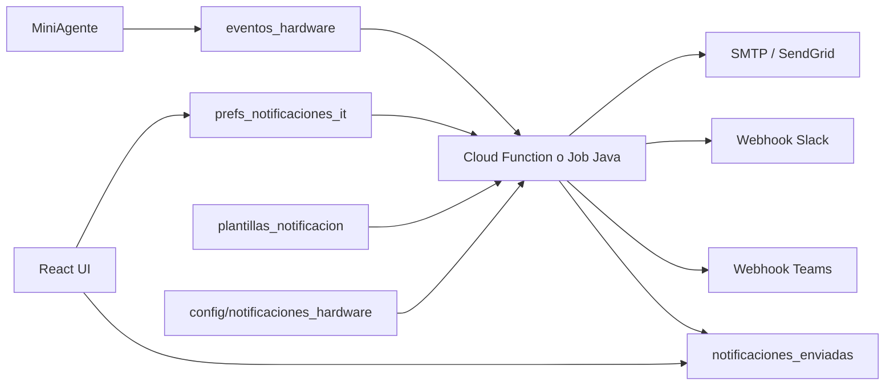

# Plan de notificaciones push — Auditoría de hardware (Inventario)

> **Proyecto:** MiniAgente-Inventario (Java + React)  
> **Alcance:** exclusivo del inventario. El agente **no** participa en este módulo.  
> **Depende de:** colección `eventos_hardware` creada por MiniAgente (ver `PLAN_AUDITORIA_HARDWARE.md`)  
> **Versión del documento:** 1.0 — Septiembre 2026  
> **Fase prevista:** 7 (opcional, posterior al MVP in-app de Fase 3)

---

## 1. Resumen

Las notificaciones **in-app** (badge, lista de pendientes, campo `leido`) están cubiertas en el plan principal — **Fase 3**.

Este documento define el módulo **push** (email, Slack, Teams) y su auditoría: reglas, preferencias por usuario IT, plantillas y registro de envíos.

| Capa | Responsable | Rol |
|------|-------------|-----|
| **Evento de hardware** | Agente | Crea doc en `eventos_hardware` con `estado_seguimiento: "pendiente"` |
| **Alertas in-app** | Inventario (Fase 3) | Badge, lista, workflow, timeline |
| **Notificaciones push** | Inventario (Fase 7) | Dispatcher, prefs, plantillas, canales externos |

El agente **no envía** emails ni webhooks. Solo escribe eventos.

---

## 2. Fuera de alcance de este módulo

- Detección de cambios, snapshot local, fingerprints (agente).
- Bloqueo físico de hardware.
- Integración automática con Jira/tickets (evaluable en fase posterior; v1 usa `notas_it` manual).
- Notificaciones al usuario final de la PC (solo personal IT).

---

## 3. Arquitectura



### 3.1 Opciones de implementación del dispatcher

| Opción | Pros | Contras |
|--------|------|---------|
| **Cloud Function** `onCreate` en `eventos_hardware` | Tiempo real, desacoplado del backend Java | Otra pieza en Firebase, secrets en GCP |
| **Job en backend Java** | Mismo stack, misma autenticación | Polling o listener Firestore en JVM |
| **Híbrido** | CF dispara; Java expone API de prefs/plantillas | Más moving parts |

**Recomendación v1 push:** Cloud Function para envío inmediato + backend Java para CRUD de prefs/plantillas y consulta de historial.

---

## 4. Modelo de datos

### 4.1 Colección `notificaciones_enviadas` (auditoría de envíos)

Un documento **por intento de envío** (un evento de hardware puede generar varios: email + Slack + reintentos).

```json
{
  "evento_hardware_id": "abc123evento",
  "uuid_pc": "pc-uuid",
  "hostname": "OFICINA01",
  "tipo_componente": "monitor",
  "tipo_evento": "agregado",
  "fingerprint": "SN:ABC123",

  "canal": "email",
  "destino": "it-operaciones@empresa.com",
  "destino_tipo": "grupo",
  "plantilla_id": "hardware_monitor_agregado_v1",

  "estado": "enviado",
  "error": null,
  "proveedor": "sendgrid",
  "proveedor_message_id": "sg-xxx",

  "asunto": "[HW] Monitor agregado en OFICINA01",
  "cuerpo_preview": "Se detectó un monitor conectado...",

  "creado_en": "<timestamp>",
  "enviado_en": "<timestamp>",
  "expire_at": "<timestamp + 180 días>"
}
```

**Valores `estado`:** `pendiente` | `enviado` | `fallido` | `omitido` | `suprimido`

**Valores `canal`:** `email` | `slack` | `teams` | `webhook`

**Motivos de `omitido` / `suprimido`:** usuario desuscrito, fuera de horario, dedup en ventana N min, severidad por debajo del umbral, digest agrupado.

**Índices Firestore sugeridos:**

- `(evento_hardware_id ASC, creado_en DESC)`
- `(estado ASC, creado_en DESC)`
- `(uuid_pc ASC, creado_en DESC)`
- `(expire_at ASC)` — job de limpieza

---

### 4.2 Colección `prefs_notificaciones_it` (preferencias por usuario)

Un documento por **usuario IT** (Firebase Auth `uid` o email corporativo como ID).

```json
{
  "usuario_id": "firebase-uid",
  "email": "juan@empresa.com",
  "nombre": "Juan IT",
  "activo": true,

  "canales": {
    "email": { "habilitado": true, "direccion": "juan@empresa.com" },
    "slack": { "habilitado": false, "user_id": "U0123ABC" },
    "teams": { "habilitado": false }
  },

  "severidad_minima": "media",
  "componentes": ["monitor", "ram", "disco", "procesador"],
  "tipos_evento": ["agregado", "removido", "modificado"],

  "solo_no_autorizado": false,
  "horario": {
    "habilitado": true,
    "zona": "America/Argentina/Buenos_Aires",
    "dias": [1, 2, 3, 4, 5],
    "desde": "08:00",
    "hasta": "18:00"
  },

  "agrupar_en_ventana_min": 10,
  "silenciar_falso_positivo": true,

  "areas": ["Sistemas", "Oficina Central"],
  "actualizado_en": "<timestamp>"
}
```

**Severidad por defecto (si no hay override en config global):**

| Evento | Severidad |
|--------|-----------|
| Procesador modificado | `critica` |
| RAM agregada / removida | `alta` |
| Disco agregado / removido | `alta` |
| Monitor agregado / removido | `media` |
| Modificado menor | `baja` |

Orden: `baja` < `media` < `alta` < `critica`. El dispatcher notifica si `severidad_evento >= prefs.severidad_minima`.

---

### 4.3 Colección `plantillas_notificacion`

Plantillas versionadas; editables desde inventario (rol admin IT).

```json
{
  "id": "hardware_monitor_agregado_v1",
  "activa": true,
  "version": 1,
  "tipo_componente": "monitor",
  "tipo_evento": "agregado",
  "severidad": "media",
  "idioma": "es",

  "email": {
    "asunto": "[{{severidad}}] {{tipo_evento}} {{tipo_componente}} — {{hostname}}",
    "cuerpo_html": "<p>En <b>{{hostname}}</b> se detectó un cambio de hardware.</p>",
    "cuerpo_texto": "En {{hostname}} se detectó un cambio de hardware."
  },

  "slack": {
    "blocks": [
      {
        "type": "section",
        "text": {
          "type": "mrkdwn",
          "text": "*{{hostname}}*: {{tipo_componente}} {{tipo_evento}}"
        }
      }
    ]
  },

  "variables_disponibles": [
    "hostname",
    "uuid",
    "tipo_componente",
    "tipo_evento",
    "fingerprint",
    "antes",
    "despues",
    "link_inventario",
    "severidad"
  ]
}
```

**Resolución de plantilla:** `{tipo_componente}_{tipo_evento}` + fallback genérico `hardware_generico_v1`.

---

### 4.4 Documento `config/notificaciones_hardware`

Configuración global (un solo doc). **Sin PII** de usuarios.

```json
{
  "habilitado": true,
  "modo": "produccion",

  "canales_globales": {
    "email_grupo_it": "it-hardware@empresa.com",
    "slack_webhook_url": "https://hooks.slack.com/services/...",
    "teams_webhook_url": "https://outlook.office.com/webhook/..."
  },

  "reglas": {
    "notificar_solo_pendiente": true,
    "dedup_minutos": 10,
    "max_reintentos": 3,
    "reintento_backoff_seg": [60, 300, 900],
    "agrupar_eventos_misma_pc": true
  },

  "severidad_por_componente": {
    "procesador": "critica",
    "ram": "alta",
    "disco": "alta",
    "monitor": "media"
  }
}
```

Los webhooks y API keys **no** se exponen al frontend; solo el backend o Cloud Functions con service account.

---

### 4.5 Campos opcionales en `eventos_hardware` (escritos por dispatcher)

El agente no los toca. El inventario/dispatcher puede agregar:

```json
{
  "notificacion_enviada_en": "<timestamp>",
  "canales_notificados": ["email", "slack"]
}
```

No modificar `estado_seguimiento` desde el dispatcher.

---

## 5. Flujo del dispatcher

```
onCreate eventos_hardware/{id}
  │
  ├─ config.habilitado == false → fin
  ├─ evento.estado_seguimiento != "pendiente" → fin (si notificar_solo_pendiente)
  │
  ├─ Calcular severidad (config + tipo_componente + tipo_evento)
  │
  ├─ Dedup: ¿existe notificaciones_enviadas reciente
  │     mismo uuid + fingerprint + tipo_evento en dedup_minutos?
  │     → escribir suprimido, fin
  │
  ├─ Resolver destinatarios:
  │     prefs individuales (componente, severidad, área, horario, activo)
  │     + email_grupo_it / webhooks globales
  │
  ├─ Elegir plantilla (tipo_componente + tipo_evento)
  ├─ Renderizar variables (incl. link_inventario)
  │
  ├─ Por cada canal/destino:
  │     enviar → notificaciones_enviadas (enviado | fallido)
  │     reintentos según backoff
  │
  └─ (Opcional) patch evento: notificacion_enviada_en, canales_notificados
```

---

## 6. Reglas anti-spam y deduplicación

| Regla | Comportamiento |
|-------|----------------|
| **Dedup evento** | Mismo `uuid + fingerprint + tipo_evento` en `dedup_minutos` → un solo envío |
| **Debounce monitor** (v2) | Par `removido` + `agregado` en 5 min → un digest “posible reconexión” |
| **Horario IT** | Fuera de ventana → `omitido` o cola para digest matutino |
| **Agrupación misma PC** | Varios eventos en N min → un mail “3 cambios en OFICINA01” |
| **Falso positivo** | Si IT marca `falso_positivo`, no re-notificar ese fingerprint 7 días |
| **Coexistencia con dedup inventario** | La dedup de **lista UI** (~10 min) es independiente; esta dedup es para **envío push** |

---

## 7. Tipos de notificación

| Tipo | Fase | Descripción |
|------|------|-------------|
| **In-app** | 3 | Badge + lista; campos `leido`, `estado_seguimiento` |
| **Push inmediata** | 7a | Email (y opc. Slack) al crear evento `pendiente` |
| **Digest diario** | 7b | Job 08:00 — resumen pendientes / no autorizados |
| **Escalamiento** | 8 (opc.) | `pendiente` > 24 h y severidad alta/crítica → supervisor |

---

## 8. API REST (Inventario)

| Método | Ruta | Descripción |
|--------|------|-------------|
| `GET` | `/notificaciones/mis-prefs` | Preferencias del usuario logueado |
| `PUT` | `/notificaciones/mis-prefs` | Actualizar canales, severidad, horario |
| `GET` | `/notificaciones/enviadas` | Historial (filtros: `eventoId`, `uuid`, `estado`) |
| `GET` | `/admin/plantillas-notificacion` | Listar plantillas |
| `POST` | `/admin/plantillas-notificacion` | Crear plantilla |
| `PUT` | `/admin/plantillas-notificacion/{id}` | Editar plantilla |
| `POST` | `/admin/notificaciones/test` | Envío de prueba al usuario actual |
| `GET` | `/admin/config/notificaciones-hardware` | Leer config global (sin secrets en respuesta) |
| `PUT` | `/admin/config/notificaciones-hardware` | Actualizar reglas (admin) |

---

## 9. UI (React)

| Pantalla | Funcionalidad |
|----------|---------------|
| **Mis notificaciones** | Toggles email/Slack, severidad mínima, horario, componentes |
| **Admin → Plantillas** | Editor asunto/cuerpo, preview con variables |
| **Admin → Config global** | Habilitar push, dedup, emails de grupo |
| **Detalle evento hardware** | Tab “Notificaciones enviadas” — historial de `notificaciones_enviadas` |
| **Admin → Test** | Botón “Enviarme prueba” |

---

## 10. Seguridad y compliance

- Webhooks y API keys solo en backend / Secret Manager / Cloud Functions env.
- `notificaciones_enviadas`: lectura usuarios IT autenticados; escritura solo service account del dispatcher.
- `prefs_notificaciones_it`: cada usuario edita el suyo; admin puede listar.
- Plantillas admin-only.
- Política de datos: seriales de hardware en Slack/email según política interna → plantilla **reducida** (sin serial en cuerpo) si aplica.

**Reglas Firestore (borrador):**

```
notificaciones_enviadas:
  - create: false (solo dispatcher)
  - read: authenticated IT
  - update/delete: admin

prefs_notificaciones_it:
  - read/write: owner OR admin
  - create: authenticated IT (propio doc)

plantillas_notificacion:
  - read: authenticated IT
  - write: admin

config/notificaciones_hardware:
  - read: authenticated IT (respuesta sin secrets)
  - write: admin
```

---

## 11. Fases de implementación

### Fase 7a — Email mínimo (1 semana)

- [ ] Doc `config/notificaciones_hardware` en Firestore
- [ ] Colección `notificaciones_enviadas`
- [ ] Cloud Function `onCreate(eventos_hardware)` → email a `email_grupo_it`
- [ ] Plantilla fija hardcoded o 1 plantilla en Firestore
- [ ] Dedup 10 min
- [ ] Tab historial en detalle de evento (solo lectura)

**Entregable:** IT recibe mail al detectarse cambio de hardware.

### Fase 7b — Preferencias y severidad (1 semana)

- [ ] Colección `prefs_notificaciones_it`
- [ ] API + pantalla “Mis notificaciones”
- [ ] Filtro por severidad, componente, horario
- [ ] Estados `omitido` / `suprimido` visibles en historial

### Fase 7c — Slack, Teams y plantillas (1–2 semanas)

- [ ] CRUD `plantillas_notificacion`
- [ ] Render de variables + `link_inventario`
- [ ] Webhooks Slack/Teams desde config
- [ ] Admin UI plantillas + test send

### Fase 7d — Digest y escalamiento (opcional)

- [ ] Job diario resumen pendientes
- [ ] Escalamiento 24 h para severidad alta/crítica
- [ ] Agrupación multi-evento misma PC

---

## 12. Pruebas

| Escenario | Resultado esperado |
|-----------|-------------------|
| Evento `pendiente` creado | 1 email a grupo IT; doc en `notificaciones_enviadas` |
| Mismo evento duplicado en 5 min | Segundo envío `suprimido` |
| Usuario con severidad_minima `alta`, evento monitor | `omitido` |
| Fuera de horario laboral | `omitido` o digest según config |
| Webhook Slack caído | `fallido` + reintento backoff |
| POST `/admin/notificaciones/test` | Mail de prueba al usuario |

---

## 13. Relación con el plan del agente

| Documento | Contenido |
|-----------|-----------|
| `PLAN_AUDITORIA_HARDWARE.md` | Agente + inventario MVP (Fases 0–6) |
| **Este documento** | Solo push y prefs (Fase 7+, inventario) |

El contrato de entrada es el documento en `eventos_hardware` definido en §6.2 del plan del agente. Este módulo **no requiere cambios en el `.exe`**.

---

## 14. Referencias

- Plan principal: `docs/PLAN_AUDITORIA_HARDWARE.md`
- Colección origen: `eventos_hardware`
- Workflow IT: `pendiente` → `en_revision` → `autorizado` | `no_autorizado` | `falso_positivo`

---

*Documento para MiniAgente-Inventario. v1.0 — notificaciones push post-MVP in-app.*
